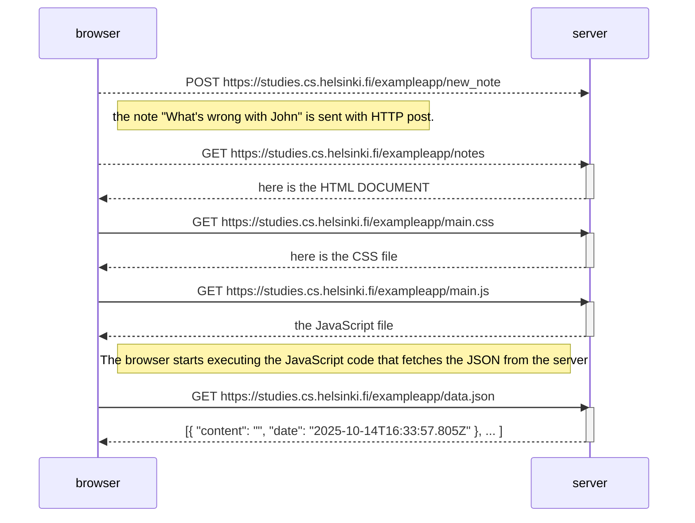

```mermaid
sequenceDiagram
    participant browser
    participant server

    browser-->>server: POST https://studies.cs.helsinki.fi/exampleapp/new_note
    Note right of browser: the note "What's wrong with John" is sent with HTTP post.
    browser-->>server: GET https://studies.cs.helsinki.fi/exampleapp/notes
    activate server
    server-->>browser: here is the HTML DOCUMENT
    deactivate server

    browser->>server: GET https://studies.cs.helsinki.fi/exampleapp/main.css
    activate server
    server-->>browser: here is the CSS file
    deactivate server

    browser->>server: GET https://studies.cs.helsinki.fi/exampleapp/main.js
    activate server
    server-->>browser: the JavaScript file
    deactivate server

    Note right of browser: The browser starts executing the JavaScript code that fetches the JSON from the server

    browser->>server: GET https://studies.cs.helsinki.fi/exampleapp/data.json
    activate server
    server-->>browser: [{ "content": "", "date": "2025-10-14T16:33:57.805Z" }, ... ]
    deactivate server
```