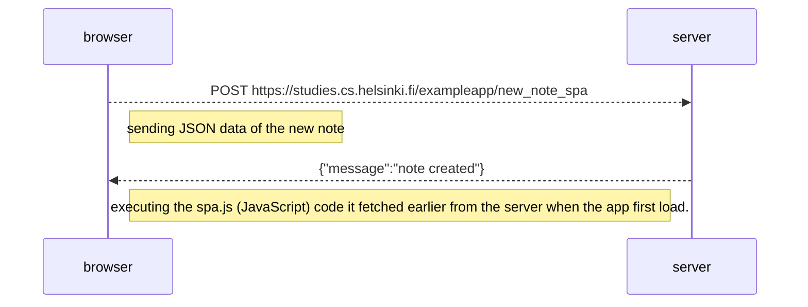

```mermaid
sequenceDiagram
    participant browser
    participant server

    browser-->>server: POST https://studies.cs.helsinki.fi/exampleapp/new_note_spa
    Note right of browser: sending JSON data of the new note 
    server-->>browser: {"message":"note created"}
    Note right of browser: executing the spa.js (JavaScript) code it fetched earlier from the server when the app first load.
    
```